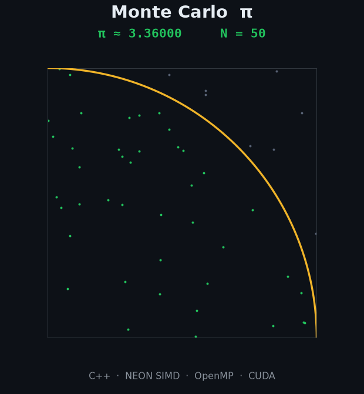

# Accelerating Monte Carlo $\pi$ Step-by-Step

[](https://en.cppreference.com/w/cpp/20)
[](https://developer.arm.com/architectures/instruction-sets/simd-isas/neon)
[](https://cmake.org)
[](LICENSE)

<p align="center">
  
</p>

This project estimates $\pi$ with a Monte Carlo method, then optimizes the same calculation step by step — from a scalar
baseline to hand-written SIMD, multiple cores, and finally a GPU.

It's an embarrassingly parallel toy problem, which makes it a clean sandbox for low-level optimization. Inspired by Mike
Croucher's lecture at EUMASTER4HPC (Luxembourg), I documented every step: what I changed, why, and the ideas that didn't
pan out. If you're learning performance engineering too, I hope you can follow along.

Have fun :)

---

## 📊 Results

At $10^{9}$ (1 billion) samples. Throughput — samples processed per second — is the headline number; higher is better.

| Version | Change                         | Device       | ns/sample ↓ | Throughput ↑ |     vs v0 |
|:-------:|:-------------------------------|:-------------|------------:|-------------:|----------:|
| **v0**  | libc `rand()`                  | M1 · 1 core  |      14.713 |    0.068 G/s |        1× |
| **v1**  | inlinable PCG32                | M1 · 1 core  |       2.144 |     0.47 G/s |      6.8× |
| **v2**  | branchless hit test            | M1 · 1 core  |       2.127 |     0.47 G/s |      6.9× |
| **v3**  | SIMD (NEON, 4-lane LCG)        | M1 · 1 core  |       0.316 |     3.16 G/s |       46× |
| **v4**  | v3 kernel × 8 threads (OpenMP) | M1 · 8 cores |       0.067 |     14.9 G/s |      217× |
| **v5**  | CUDA grid-stride               | Tesla T4 GPU |      0.0055 |      180 G/s | ~2,650× * |

<sub>ns/sample = time per sample (minimum of 10 runs). throughput = 1 / (ns per sample). Every version stays within
~10⁻⁴ of π. &nbsp; **\*** cross-hardware: v5 is a T4 GPU, not the M1 — see the v5 section for the fair comparison.</sub>


<sub>**Figure 1** — speedup, v0→v4 (Apple M1) and v5 (Tesla T4 GPU). Log scale, lower is better.</sub>

---

## How I got there

I measured before every change. A few of those checks turned out more interesting than the speedups themselves:

- **v0 → v1** — the profiler showed `rand()` eating ~88% of the run, so the fix wasn't clever maths, just replacing it
  with an inlinable PCG32. **6.8×**.
- **v1 → v2** — I was sure removing an `if` would help. It did nothing: v1 and v2 compile to *identical* assembly — the
  compiler had already made the branch branchless. The compiler is usually smarter than me.
- **v2 → v3** — SIMD does four samples per instruction; you can see it in the assembly, where everything goes 4-wide.
  That's the big jump. **46×**.


<sub>The v0 profile: `rand()` and its dynamic-linker stub dominate the run.</sub>

The full breakdown — profiler output, annotated assembly, the CUDA experiment — is in [`docs/Versions.md`](docs/Versions.md).

<details>
<summary><b>Why v3's gain isn't pure SIMD</b></summary>

<br>

v0 → v2 keep the PRNG fixed (PCG32) and change one thing at a time; v3 changes three at once — 4-wide SIMD, `float32`
instead of `double`, and a cheaper 4-lane LCG in place of PCG32 — so its gain isn't attributable to NEON alone.
Vectorizing PCG32 would need cross-lane shifts and its permutation step, so to isolate raw arithmetic throughput v3 uses
a vectorized 32-bit LCG: cheaper, but statistically weaker (LCGs have known low-bit and lattice/spectral defects). For
cryptographic or high-dimensional Monte Carlo, a 4-lane xoshiro128+ or a vectorized PCG should be substituted.
</details>

---

## v4 — multiple cores (OpenMP)

Same SIMD kernel as v3, just spread across the M1's cores with OpenMP — so any speedup is pure parallelism (v4 on one
thread matches v3). The M1 mixes 4 performance and 4 efficiency cores, and the difference is measurable:

|   Threads   | $10^{8}$ speedup | eff. | $10^{9}$ speedup | eff. |
|:-----------:|:----------------:|:----:|:----------------:|:----:|
|      1      |      1.00×       |  —   |      1.00×       |  —   |
|      2      |      1.98×       | 99%  |      1.98×       | 99%  |
| 4 (P-cores) |      3.38×       | 85%  |      3.74×       | 94%  |
| 8 (4P + 4E) |      4.44×       | 55%  |      4.70×       | 59%  |


<sub>**Figure 2** — parallel speedup vs. thread count.</sub>

Scaling is near-linear on the 4 performance cores (3.74× at $10^9$, 94% efficiency). The 4 efficiency cores are much
slower, so 8 threads reach 4.70×, not 8×.

---

## v5 — the GPU (CUDA)

A GPU trades a few fast cores for thousands of slow ones. The same kernel in CUDA, on a Tesla T4 (Google Colab), reaches
180 Gsample/s — about 12× the best CPU (v4). The full kernel is in [`cuda/pi.cu`](cuda/pi.cu).

It only wins at scale, though, because a GPU is a *throughput device*:

| Samples | Kernel time |    Throughput |
|--------:|------------:|--------------:|
|  $10^6$ |    0.109 ms |   9 Gsample/s |
|  $10^7$ |    0.121 ms |  83 Gsample/s |
|  $10^8$ |    0.565 ms | 177 Gsample/s |
|  $10^9$ |    5.549 ms | 180 Gsample/s |

At $10^6$ the GPU manages only 9 G/s: 65,536 threads over a fixed launch cost have too little work to amortize.
Throughput climbs with $N$ and saturates near $10^8$–$10^9$ — the CPU wins the small jobs (low latency), the GPU wins the
big ones. Timing is kernel-only and a single run, and the ~2,650× vs v0 is a device comparison — the fair number is v5
vs v4, about 12×.

---

## Build & Reproduce

Needs **CMake ≥ 3.20** and a **C++20 compiler** (Apple Clang on macOS; GCC/Clang on Linux with ARM64 NEON). v4 needs the
**OpenMP runtime** — Apple Clang ships without it, so on macOS: `brew install libomp` (`CMakeLists.txt` points at
`/opt/homebrew/opt/libomp`; adjust for Intel macOS or Linux).

```bash
cmake -S . -B build -DCMAKE_BUILD_TYPE=Release
cmake --build build
./build/pi_bench          # always the Release build — Debug disables inlining and SIMD
```

The GPU version builds separately, with the CUDA toolkit:

```bash
nvcc -arch=sm_75 -O3 cuda/pi.cu -o pi && ./pi     # -arch=sm_75 targets the T4; change for your GPU
```

---

## Repository Layout

```
src/
  main.cpp        # benchmark runner
  versions.hpp    # function interfaces + scalar PRNG
  versions.cpp    # kernels: v0->v3 (scalar->SIMD) + v4 (OpenMP)
  bench.hpp       # timing harness (warmups, min, throughput)
cuda/
  pi.cu           # v5: the GPU kernel (grid-stride + atomics)
docs/
  Approach.md     # the measure-first method
  Versions.md     # the full engineering log
  images/         # figures and profiler screenshots
```

<details>
<summary><b>Experimental rig &amp; known constraints</b></summary>

<br>

- **Hardware.** v0–v4: Apple M1 (MacBook Air, 8 GB). v5: NVIDIA Tesla T4 (Google Colab, CUDA 12.8), a single
  kernel-timed run rather than the CPU's min-of-10.
- **Frequency scaling.** macOS won't let me pin the clock or disable turbo, so the harness discards 2 warm-ups, times 10
  runs, and reports the minimum (the run least perturbed by OS noise).
- **Dispersion.** The harness keeps min / spread (max − min), not a full σ. Even so, the tight spread on the optimized
  kernels (0.001 ns on v3 vs 1.735 ns on v0) shows the speedups aren't a single lucky run.
- **Heterogeneous cores.** macOS gives no way to pin threads, and the M1 has 4 performance + 4 efficiency cores — which
  is why 8 threads reaches ~4.7×, not 8×. On a fanless laptop, timings also drift with thermal state; treat these as
  indicative laptop numbers, not a controlled HPC node.
</details>

---

## ⭐ Support & Feedback

If you found this useful, a star is appreciated. I'm always looking to improve — if you spot an inaccuracy or have an
idea for another optimization step, open an issue.

Thank you for you attention ! :)

Youssef El aamraoui

## License

MIT — see [`LICENSE`](LICENSE). Fork, benchmark, and build on it.
