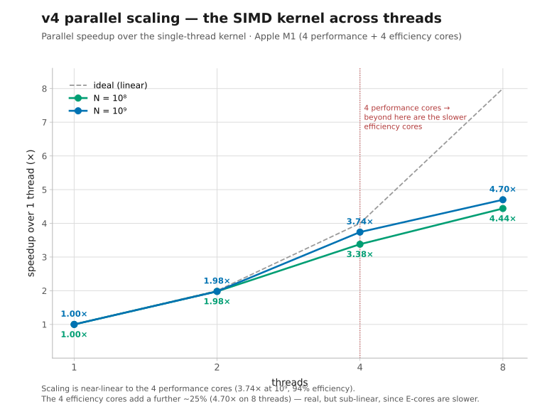
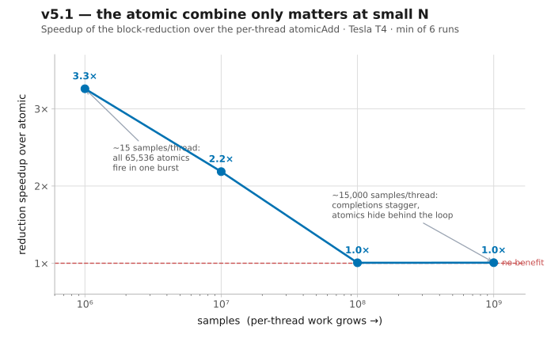
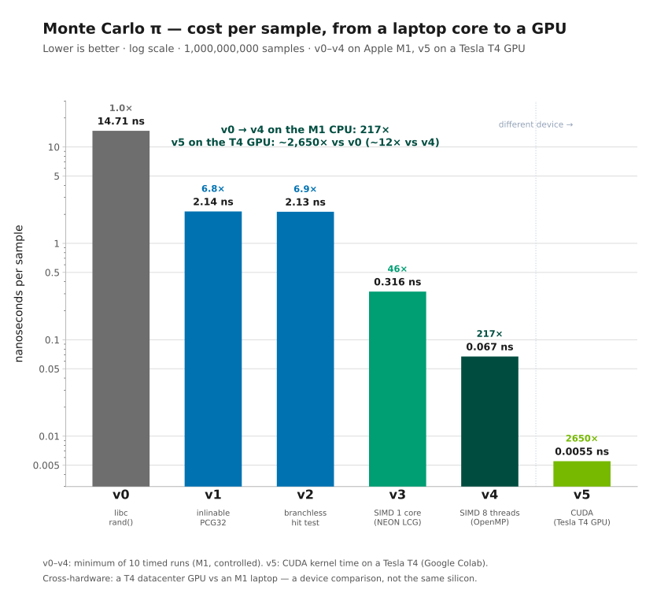
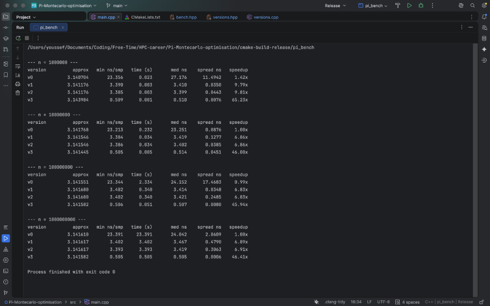

# Versions Log

Each version builds from the previous, with a prediction written *before* the
measurement so I can tell whether the change did what I expected. Baseline method
is in [`Approach.md`](images/Approach.md).

---

<details>
<summary><b>How I profiled — tools &amp; method on macOS</b></summary>

<br>

### Tool Selection & macOS Constraints

The usual tool is `perf`, but that's Linux-only, so my options were:

- **CLion** → the three-dots menu next to Debug has a *Profile* action. On macOS it drives DTrace and shows a flame
  graph. Catch: System Integrity Protection makes DTrace finicky and it often needs elevated privileges, so it may not
  work cleanly first try.
- **Instruments** (ships with Xcode / the Command Line Tools) → the standard professional tool. **This is the one I went
  with.**
- **The `sample` command** → the quickest look, zero setup. Run the binary and, while it's churning through the 100M
  case, in another terminal run `sample <pid>` (or `sample pi_bench 5` for a 5-second sample). It prints a call tree
  with counts.

### Compilation Target Requirement

One non-negotiable, whichever you pick: **profile the Release build, not Debug.** Debug builds aren't optimized, you'd
be measuring code the real optimizer would never emit.

### Mechanics of Sampling Profilers

It doesn't measure your code directly. It pauses the program many times per second (~1000/sec by default) and records
which function was running at that instant. After thousands of pauses, a function caught running ~70% of the time was,
in fact, using ~70% of the CPU. So the number isn't "seconds spent in `rand()`", it's "the fraction of samples that
landed in `rand()`,".

### Sampling Implications & Duration

Consequence: the interesting part has to run *long enough* to collect enough samples.

</details>

---

## v0 — Baseline with `rand()`

### Finding the bottleneck:


rand and its machinery are clearly the bottleneck. Reading the profile carefully, mc_pi_v0 takes 1.29 s of the 1.63 s
total (79%), and inside that the RNG cost is split across three rows:

1) rand itself → 711 ms
2) DYLD-STUB$$rand → 380 ms.
3) a second rand entry → 339 ms

Number (2) is the cost of all calls to the library that has rand.

Together those three are ~1430 ms, about 88% of the total runtime.
Meanwhile, mc_pi_v0 is only 201 ms, so only ~12% of the runtime.

### Prediction for v1:

Since, mc_pi_v0, is only ~200 ms, if the RNG became essentially free I'd expect to land near
there, roughly a 3× speedup.

---

## v1 — Swap `rand()` for an Inlinable PCG32

### The Problem

With `rand()` confirmed as the bottleneck, the next choice is the replacement generator. Evaluated PRNG alternatives
for the scalar loop:

| Generator       | State  | Speed     | Quality                         | Get-it-wrong risk | Notes                                                                                          |
|-----------------|--------|-----------|---------------------------------|-------------------|------------------------------------------------------------------------------------------------|
| xorshift32/64   | 4–8 B  | very fast | adequate, some known weaknesses | low               | Classic "simplest fast PRNG," ~3 shifts + XORs. Fails some strict tests but fine for π         |
| splitmix64      | 8 B    | very fast | good                            | very low          | One multiply-shift-xor chain. Often used to seed others, but fine standalone here              |
| PCG32           | 8–16 B | fast      | high                            | low-medium        | Well-documented, passes strong batteries. A multiply + a permutation step. The "solid default" |
| xoshiro256++/** | 32 B   | very fast | high                            | medium            | Modern, excellent quality/speed. Bigger state; must avoid an all-zero seed                     |

> Note: All of these are pseudo-random, deterministic formulas imitating randomness.

### Decision: PCG32.

Quality isn't the deciding factor here (π is forgiving), so
the choice came down to PCG, which is a well-documented generator.
Its main risk is seeding/constants, so my correctness check for v1 is: π must converge to
~3.14159 and the error must shrink roughly like `1/√n`, which is Monte Carlo's rate of convergence

## v2 — Remove the Branch

During my course in ACA (Advanced Computer Architecture at Polimi) the professors highlighted the fact that branch
mispredictions carry a high pipeline cost, so I assumed refactoring the hit test to drop the `if`
(`count += (x*x + y*y <= 1.0)`) would improve throughput.

Manual branchless refactoring yielded 0 speedup — and the assembly shows why. v1 and v2 compile byte-for-byte
identical: `clang -O3` had already lowered the `if` to a `cinc` (conditional increment). The hit test in both is:

```asm
fcmp    d1, d0        ; compare  r = x*x + y*y  against  1.0
cinc    x8, x8, ls    ; count += 1 if (r <= 1.0)   -- no branch
```

`cinc` adds 1 when the condition holds, with no branch — the only branch in the loop is the `b.ne` back-edge. The
compiler beat the manual optimization.

I did not expect much improvement/speed up here, nonetheless learning that there are already optimizations like these
caught me by surprise, rookie mistake.

---

## v3 — SIMD

### The Problem

Until now each instruction ran on one piece of data at a time. SIMD(Single
Instruction, Multiple Data) is exactly the situation I'm in: one instruction (ex: multiply) applied to multiple data
lanes at once. So instead of processing sample `i`, I process samples `i, i+1, i+2, i+3` together.

Two ways to get there:

- **Auto-vectorization** : restructure the loop to be "compiler-friendly" and hope
  `-O3` vectorizes it. Easy, but often fails on RNG loops (the state dependency
  confuses the compiler), and you learn less because you can't see what happened.
- **Intrinsics** : write the vector operations explicitly with functions that map
  one-to-one to vector instructions. Harder, fully in your control, and you see
  exactly what the CPU does. This is the "learn it properly" path, and the one I
  want.

The only issue is SIMD wants four `(x, y)` values at once, but a PRNG's outputs are
sequential, which means each state depends on the previous, so I can't get four independent
values in one step from the current generator.

To feed four lanes I need a PRNG variant that produces four streams in parallel.

### Solution: a 4-lane LCG with decoupled X and Y streams

To saturate a 128-bit NEON vector register (which holds $4 \times 32$-bit integers), we advance 4 independent
pseudo-random streams in lockstep using a Linear Congruential Generator (LCG):

$$\text{state}_{t+1} = (\text{state}_t \times M + C) \pmod{2^{32}}$$

With Numerical Recipes constants ($M = 1664525, C = 1013904223$), the multiplication overflow natively
computes $\pmod{2^{32}}$ for free in 32-bit registers.

#### Key Architectural Components:

1. **Decoupled Seeding (Avoiding 2D Correlation Collapse)**:
   If $X$ and $Y$ share the same seed or stream, all points collapse onto the line $y = x$, and $\pi$ erroneously
   converges to $4 / \sqrt{2} \approx 2.8284$.
   We use `splitmix32(z)` with $z$ passed by reference to generate 8 consecutive, non-overlapping initial seeds: 4 for
   `statex` and 4 for `statey`.

2. **Pipelined Vector Generator (`next_float4`)**:
   ```cpp
   static inline float32x4_t next_float4(uint32x4_t &state, uint32x4_t M, uint32x4_t C, float32x4_t inv_scale) {
       state = vmlaq_u32(C, state, M);                             // 1. Advance 4 states with fused multiply-add
       uint32x4_t top24x = vshrq_n_u32(state, 8);                  // 2. Extract top 24 bits
       float32x4_t f = vcvtq_f32_u32(top24x);                      // 3. Convert to 32-bit float
       return vmulq_f32(f, inv_scale);                             // 4. Multiply by reciprocal (2^-24)
   }
   ```
    * **Why shift 8 bits?** Single-precision IEEE-754 floats have 23 explicit mantissa bits + 1 implicit leading bit =
      24 bits of precision. Keeping the top 24 bits prevents rounding noise.
    * **Why reciprocal multiply?** Multiplication on ARM NEON is fully pipelined with a 1-cycle throughput.
      Floating-point division takes 10–15 cycles.

3. **Fused Multiply-Add (FMA) Geometry Check**:
   ```cpp
   float32x4_t r = vmulq_f32(x, x);
   r = vmlaq_f32(r, y, y); // r = x*x + y*y in a single fused instruction
   ```

4. **Branchless Two's-Complement Accumulation**:
   `vcleq_f32(r, 1.0f)` returns an all-ones bitmask (`0xFFFFFFFF` $\equiv -1$) for hits, and `0x0` for misses.
   Subtracting this mask (`hits = vsubq_u32(hits, mask)`) computes $\text{hits} - (-1) = \text{hits} + 1$ without any
   branch misprediction penalties.

5. **Horizontal Vector Reduction**:
   After the loop, `vaddvq_u32(hits)` performs a hardware horizontal reduction across the 4 lanes to yield the scalar
   total hit count.

### Am I sure it worked?

In order to be sure, about the vectorization I used the same trick as v2: I read the assembly.

The tell is the suffix `.4s` on nearly every instruction in the loop — it means
"4 lanes of 32-bit float", i.e. four samples handled at once. Next to v1/v2 the contrast is obvious:

| Feature        | v1 / v2 (Scalar)          | v3 (Vector NEON)               |
|:---------------|:--------------------------|:-------------------------------|
| **Registers**  | `d1`, `x8` (single value) | `v6.4s`, `v0.4s` (four values) |
| **Multiply**   | `fmul d1, d1, d1`         | `fmul v6.4s, v6.4s, v6.4s`     |
| **Precision**  | `d` = double (64-bit)     | `.4s` = float (32-bit)         |
| **Loop trips** | $N$                       | $N / 4$ (via `asr x8, x8, #2`) |

The loop body, annotated:

```asm
mla    v5.4s, v6.4s, v2.4s   ; LCG step  state*M + C  for 4 X's at once (again below for Y)
ucvtf  v6.4s, v7.4s, #24     ; convert 4 ints -> 4 floats in [0,1)
fmla   v6.4s, v7.4s, v7.4s   ; x*x + y*y for 4 points in one fused multiply-add
fcmge  v6.4s, v1.4s, v6.4s   ; hit-test 4 points at once -> a 4-lane mask
sub    v0.4s, v0.4s, v6.4s   ; branchless accumulate (subtracting the -1 mask adds 1), 4 counters
addv   s0, v0.4s             ; at loop exit: sum the 4 lane-counters into one scalar
```

So each pass through the loop does four samples, and the loop runs `n/4` times, where v1/v2 ran `n` times on single
`d`-registers. That `.4s` everywhere — and the fact that `.4s` is single-precision, which also shows the double-to-float
switch — is the vectorisation, in black and white.

---

## v4 — Multi-core (OpenMP)

v4 keeps the v3 SIMD kernel byte-for-byte and only spreads its iterations across cores with OpenMP, so any speedup is
*pure parallelism* — nothing else changed. (v4 on one thread matches v3 to within noise, which is the proof of that.)

### **How it works.**

`#pragma omp parallel` forks a team of threads from a reused pool (not new OS threads per call); each
thread seeds its own RNG from `omp_get_thread_num()`, runs its slice of the loop, and `reduction(+:hits)` gives every
thread a private counter that the runtime sums once at the end — accumulate locally, combine once, so there is no false
sharing on the global count.

### What I discovered

Look at this table:

|   Threads   | speedup vs 1 thread | efficiency |
|:-----------:|:-------------------:|:----------:|
|      2      |        1.98×        |    99%     |
| 4 (P-cores) |        3.74×        |    94%     |
| 8 (4P + 4E) |        4.70×        |    59%     |

This is the speedup per thread used. Something here caught my eye, something I did not know.
Before running the experiment I assumed i would have had a linear improvement, but this did not happen.
Instead I got a linear improvement until the 4th core, then a plateau. The reason are the M1 cores. It has 4 performance
cores and then 4 efficiency cores, the performance cores are the reason behind the linear speed up and the efficiency
cores behind the plateau. It's more obvious by looking at the graph below.



*Figure — parallel speedup vs. thread count.*

Scaling is near-linear up to the 4 performance cores (94% efficiency). The 4 *efficiency* cores then
add real but sub-linear throughput — 8 threads gives 4.70×, not 8× — because an E-core is much slower than a P-core.

---

## v5 — GPU (CUDA)

I felt like the v4 saturated the CPU, in order to gain more performance speed up, I decided to deep dive into GPU
performance improvement.
Working with CPU cores is like working with specialized labor, few cores but the best ones. While working with GPU is
cheap labor, however the number of cores is much higher.

Since my M1 lacks CUDA support, I needed to transition to a cloud environment to leverage massive GPU parallelism. A GPU
trades a handful of fast cores for thousands of slow ones. The same LCG kernel, rewritten in CUDA and run on a Tesla
T4 (Google Colab).

The same LCG kernel, rewritten in CUDA and run on a Tesla T4 (Google Colab), reaches **180 Gsample/s** — about 12×
the best CPU (v4) and ~2,650× v0.

### What makes it a GPU program

- **SIMT, not SIMD.** Threads run in lock-step groups of 32 (a *warp*): I write plain scalar code and the hardware runs
  32 lanes at once. It's v3's SIMD idea, but the hardware does the vectorizing for me.


- **Latency hiding by oversubscription.** Each thread's LCG is a slow dependent chain. The GPU hides that by keeping
  thousands of threads resident and switching warps whenever one stalls — which is exactly why a GPU needs a *lot* of
  work to be fast.


- **Grid-stride loop.** A fixed grid (256 × 256 = 65,536 threads) walks the array in strides of `total_threads`, so one
  launch covers any `N`.

- **One `atomicAdd` per thread.** Each thread keeps a private `local` count and adds it to the global counter *once*, at
  the end — the same "combine once" idea as v4's reduction, so atomic contention stays negligible.

### What I chose to measure

There are two honest numbers.

1) **Kernel-only time** (`cudaEvent` around the launch) is pure compute — the fair match to
   the CPU `ns/sample`, which was also pure compute.


2) **End-to-end time** would add `cudaMalloc` and the copy back (the
   "real world" number). For Monte Carlo π they're nearly identical
   so I report kernel-only.

Note : The first launch is slow because CUDA does one-time context setup, so I run a throwaway
**warm-up** first, then time.

### Results (Tesla T4, kernel time)

| Samples | Kernel time |        Throughput | Approx π |
|--------:|------------:|------------------:|:--------:|
|  $10^6$ |    0.109 ms |       9 Gsample/s | 3.141536 |
|  $10^7$ |    0.121 ms |      83 Gsample/s | 3.141678 |
|  $10^8$ |    0.565 ms |     177 Gsample/s | 3.141682 |
|  $10^9$ |    5.549 ms | **180 Gsample/s** | 3.141667 |

---

## v5.1 — GPU: does the atomic combine actually cost anything?

After finishing v5, I had one main concern: is the atomic combine hindering performance?

Think of it this way: the atomic combine does exactly one thing. It forces the counted results into memory one at a
time (65,536 serialized additions on
a single address).
This guarantees safety, but comes with a major caveat: if all those additions hit the memory address
simultaneously, the resulting queue could severely bottleneck execution.

I predicted little to no impact, but I needed empirical proof.

To test this, I compared three combine strategies across different values of $N$:

- Per-thread atomic (v5,
  the baseline);


- Per-block reduction (shared memory + one atomic per block);


- No atomic at all (ablation): each thread writes
  its count to its own global slot. The computation stays live, but memory contention drops to zero.

The reduction kernel:

```cuda
__global__ void mc_kernel_reduce(long n, unsigned long long *global_count) {
    int id     = blockIdx.x * blockDim.x + threadIdx.x;
    int stride = gridDim.x  * blockDim.x;
    uint32_t state = 42u + id * 2654435761u;
    unsigned int local = 0;
    for (long i = id; i < n; i += stride) {
        float x = rng(state), y = rng(state);
        if (x*x + y*y <= 1.0f) local++;
    }

    __shared__ unsigned int tile[256];             // one slot per thread (block size = 256)
    tile[threadIdx.x] = local;
    __syncthreads();

    for (int s = blockDim.x / 2; s > 0; s >>= 1) { // tree reduction: halve each step
        if (threadIdx.x < s) tile[threadIdx.x] += tile[threadIdx.x + s];
        __syncthreads();
    }

    if (threadIdx.x == 0)                           // one atomic per block, not per thread
        atomicAdd(global_count, (unsigned long long) tile[0]);
}
```

Results — minimum of 6 runs, Tesla T4 on Colab, kernel time in ms:

|      N | atomic (per thread) | reduce (per block) | ablation (no atomic) | atomic ÷ reduce |
|-------:|--------------------:|-------------------:|---------------------:|:---------------:|
| $10^6$ |               0.088 |              0.027 |                0.020 |      3.3×       |
| $10^7$ |               0.094 |              0.043 |                0.040 |      2.2×       |
| $10^8$ |               0.348 |              0.346 |                0.344 |      1.0×       |
| $10^9$ |               3.403 |              3.379 |                3.389 |      1.0×       |




*Figure — the block-reduction's advantage over the per-thread atomic shrinks from 3.3x at $10^6$ to nothing by $10^8$,
once per-thread work is large enough to stagger the atomics.*

### Why is there a change in performance ?

My prediction held true for large datasets, but failed at $10^6$ and $10^7$. Why?

The behavior splits into two distinct
regimes.

#### Small samples

At small $N$ ($10^6$–$10^7$), each thread has almost no work: roughly 15 to 150 samples.
Consequently, all 65,536 threads
finish their tiny loops at nearly the exact same instant and attempt to write to the single global counter
simultaneously. Since atomicAdd forces these operations to happen sequentially, they pile up into a massive queue. In
such a short kernel execution, this queueing delay consumes a significant fraction of total runtime. The block-reduction
strategy bypasses this traffic jam: each block aggregates its 256 threads first, meaning only 256 additions ever reach
the global counter instead of 65,536. This is why block-reduction is 2–3× faster here.

#### Bigger samples

At large $N$ ($10^8$–$10^9$), each
thread processes a long loop—around 15,000 samples.
The threads now finish their work at slightly different moments,
spread across the entire kernel execution. Their additions trickle into the counter one by one rather than all at once.
Since there is no burst of traffic, there is no queue, and the block-reduction strategy saves nothing.

Furthermore,
because the loop performs 15,000 compute steps for every single atomic operation, the latency of the atomic write
vanishes entirely into the compute time.The phase transition occurs between $10^7$ and $10^8$. Once a thread handles
more than ~1,500 samples, completion times naturally desynchronize enough to prevent the burst from ever forming.

It was a good result, something I should have seen coming, but it was fun to discover nonetheless.

### Final Result



*Figure — Speedup improvement*


<details>
<summary><b>Raw benchmark output (CLion)</b></summary>

<br>



</details>

### Engineering Trade-Offs

* **LCG vs PCG32**: LCG is extremely cheap (a single fused multiply-add) and fits SIMD naturally. However, in
  higher-dimensional Monte Carlo problems, LCG suffers from the Marsaglia defect (points falling on parallel
  hyperplanes). For 2D Monte Carlo with separate initial seeds, accuracy is preserved (error $\approx 10^{-5}$
  at $N=10^9$),
  but scientific simulations often prefer counter-based PRNGs (like Philox).


* **Instruction Portability**: Intrinsics in `<arm_neon.h>` are specific to ARM64. Supporting x86 architectures requires
  mapping to AVX2/AVX-512 (`_mm256_*`) or utilizing cross-platform SIMD wrappers like Google Highway.

---

## Appendix — Concrete Benchmarking Practices

Repetition + reporting the minimum (see [`Approach.md`](images/Approach.md)) handles
random noise:

- **Warmup runs.** The first run has cold caches, the CPU hasn't ramped to full
  clock, and memory pages aren't faulted in, so it runs always slower and unrepresentative.
  Run a few and throw them away, then measure. (My harness does 2 warmups)


- **Enough work per measurement.** The timer has its own overhead and granularity.
  If a run takes microseconds, timer noise dominates; aim for tens of
  milliseconds+ per timed run so timer error is negligible.


- **Pin what you can.** Serious rigs disable frequency scaling ("turbo"), pin the
  process to one core, and run on an idle machine. On a Mac I can't fully control
  these, but you can close other apps, run on wall power and much more.

## Suggestions

If you do have any suggestions, please feel free to help me in this learning process. I tried my best during this
project, but I know there is room for improvement. 
Feel free to follow me as well, and surely I will publish more projects in the future. 

Thank you for your attention!  :) 

Youssef El aamraoui
