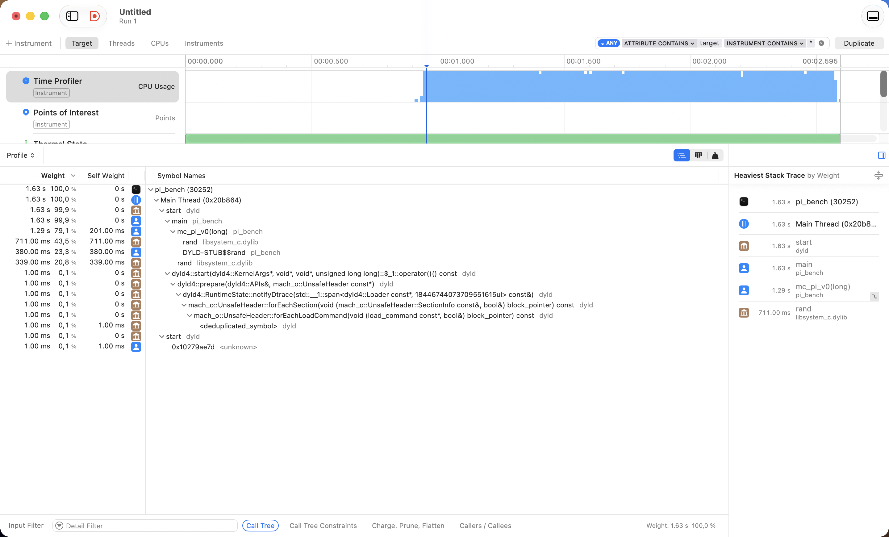

# Versions Log

Each version builds from the previous, with a prediction written *before* the
measurement so I can tell whether the change did what I expected. Baseline method
is in [`Approach.md`](images/Approach.md).

---

## Introduction : Profiling on macOS

### Tool Selection & macOS Constraints

The usual tool is `perf`, but that's Linux-only, so my options were:

- **CLion** → the three-dots menu next to Debug has a *Profile* action. On macOS it drives DTrace and shows a flame
  graph. Catch: System Integrity Protection makes DTrace finicky and it often needs elevated privileges, so it may not
  work cleanly first try.
- **Instruments** (ships with Xcode / the Command Line Tools) → the standard professional tool. **This is the one I went
  with.**
- **The `sample` command** → the quickest look, zero setup. Run the binary and, while it's churning through the 100M
  case, in another terminal run `sample <pid>` (or `sample pi_bench 5` for a 5-second sample). It prints a call tree
  with counts.

### Compilation Target Requirement

One non-negotiable, whichever you pick: **profile the Release build, not Debug.** Debug builds aren't optimized, you'd
be measuring code the real optimizer would never emit.

### Mechanics of Sampling Profilers

It doesn't measure your code directly. It pauses the program many times per second (~1000/sec by default) and records
which function was running at that instant. After thousands of pauses, a function caught running ~70% of the time was,
in fact, using ~70% of the CPU. So the number isn't "seconds spent in `rand()`", it's "the fraction of samples that
landed in `rand()`,".

### Sampling Implications & Duration

Consequence: the interesting part has to run *long enough* to collect enough samples.

---

## v0 — Baseline with `rand()`

### Finding the bottleneck:

rand and its machinery are clearly the bottleneck. Reading the profile carefully, mc_pi_v0 takes 1.29 s of the 1.63 s
total (79%), and inside that the RNG cost is split across three rows:

1) rand itself → 711 ms
2) DYLD-STUB$$rand → 380 ms. The stub: because rand lives in a shared library, my code can't jump straight to it, it jumps
into the library, and pays that indirection on every call( This ~380 ms is the
total across all calls, not the cost of one) 
3) a second rand entry → 339 ms

Together those three are ~1430 ms, about **88% of the total runtime**. Meanwhile mc_pi_v0  is only 201
ms, so only ~12% of the runtime.

### Solution & result

Prediction for v1: since my real work is only ~200 ms, if the RNG became essentially free I'd expect to land near
there, roughly a 3× speedup. I'm writing that down before measuring, so afterwards I can tell whether v1 succeeded or
whether I left performance on the table.

std::rand() lives in libc, compiled separately months before my program. My compiler only sees a declaration — a promise
that a function named rand exists somewhere — not its body. So the call is an optimization barrier. The compiler must
assume the worst: it can't reorder my arithmetic across the call, can't keep values in registers through it, and —
crucially — can't vectorize the loop (SIMD does several iterations at once, but each iteration calls rand, which must
run in sequence). The call freezes the optimizer.

Inlining is when the compiler copies a function's body straight into the call site, as if you'd typed it there. Then the
barrier vanishes and it can optimize across the whole loop. But inlining requires the compiler to see the source, which
is why a small PRNG in a header inlines beautifully and libc's rand() never can.

---

## v1 — Swap `rand()` for an Inlinable PCG32

### The Problem

Now that I verified also with the profiler, Instruments, the rand influence on the execution time, I have to decide
which generator to use instead. With Claude's help I came up with this list:

| Generator       | State  | Speed     | Quality                         | Get-it-wrong risk | Notes                                                                                           |
|-----------------|--------|-----------|---------------------------------|-------------------|-------------------------------------------------------------------------------------------------|
| xorshift32/64   | 4–8 B  | very fast | adequate, some known weaknesses | low               | Classic "simplest fast PRNG," ~3 shifts + XORs. Fails some strict tests but fine for π.         |
| splitmix64      | 8 B    | very fast | good                            | very low          | One multiply-shift-xor chain. Often used to seed others, but fine standalone here.              |
| **PCG32**       | 8–16 B | fast      | high                            | low-medium        | Well-documented, passes strong batteries. A multiply + a permutation step. The "solid default." |
| xoshiro256++/** | 32 B   | very fast | high                            | medium            | Modern, excellent quality/speed. Bigger state; must avoid an all-zero seed.                     |

> Note: All of these are **pseudo-random**, deterministic formulas imitating randomness.

### Solution & Results

**Decision: PCG32.** Quality isn't the deciding factor here (π is forgiving), so
the choice came down to the generator I'll actually reach for in real work *where
quality does matter* — PCG is well-documented, only a little more code, and
getting comfortable with it now is transferable. Its main risk is
seeding/constants, so my **correctness check** for v1 is: π must converge to
~3.14159 **and** the error must shrink roughly like `1/√n`. If that holds, the
seeding is right; if π drifts, I got it wrong.

### Questions

#### Why the PCG Code Lives in the Header

**Why the PCG code lives in the header, not the `.cpp`:** including a header copies
the code into the translation unit, so it can inline right at the call site — and
as the v0 profile showed, in this workload (small samples, lots of calls) the call
overhead is exactly what dominates.

> Rule of thumb I'm taking away: **small + called in a hot loop → inline it → put
> it in a header. Big function → don't inline → `.cpp`.**

#### What the Columns Mean

* **Quality** → how convincingly the sequence imitates true randomness:
  *uniformity* (are all values equally likely?), *independence* (can you predict
  the next from the previous? — matters here because I pair consecutive outputs
  into `(x, y)`, so 2D correlation would directly skew π), and *period* (finite
  state means it eventually loops; the period is how long until it does). Quality
  isn't opinion — it's measured by test batteries (TestU01, PractRand).
  For π specifically it's almost a non-issue; every generator here clears the bar.
  Quality would dominate for cryptography (predictability = broken) or
  high-dimensional physics (subtle correlations = wrong results). Knowing *when*
  quality matters is the real skill.
* **Get-it-wrong risk** → how easy it is to implement *incorrectly* in a way that
  still compiles, still runs, and still produces plausible-but-wrong numbers.
  Silent bugs, not crashes. E.g. xoshiro outputs zeros forever if seeded all-zero.
  For PCG the trap is the seeding step and its published constants — get one wrong
  and it still looks random-ish but isn't really PCG.

---

## v2 — Remove the Branch

### The Problem

This came from an assumption. Thanks to the ACA course at Politecnico di Milano I'd
learned how costly `if`s and branch mispredictions can be, so my first idea was to
refactor the hit test to drop the `if` (`count += (x*x + y*y <= 1.0)`).

But this runs into something I said earlier about profiling: a sampling profiler
won't show a branch cost ( misprediction, a cache miss, a stalled pipeline). The Time Profiler sees the symptom (time),
not the cause.

To *see* the branch cost you need a different tool: a **hardware-counter
profiler**. Modern CPUs have counters for low-level events, branch
mispredictions, cache misses, instructions retired. On Linux `perf stat` prints
these directly (a `branch-misses` line with a percentage), the standard way, and
part of why HPC people live on Linux. On my Mac, Instruments has a *CPU Counters*
instrument (a different template from the Time Profiler) that reads some of these,
though Apple Silicon exposes them less freely than Intel/Linux, so it's fiddlier.

### Solution & Results

**Result: the assumption was wrong.**

The time didn't change, I assume the compiler
had *already* compiled the `if` into branchless code, so my "optimization" was a
no-op. A useful negative result: worth knowing the compiler often gets there first.

---

## v3 — SIMD

### The Problem

Right now each instruction runs on one piece of data at a time. **SIMD** (Single
Instruction, Multiple Data) is exactly the situation I'm in: one instruction (ex: multiply) applied to multiple data
lanes at once. So instead of processing
sample `i`, I process samples `i, i+1, i+2, i+3` together.

Two ways to get there:

- **Auto-vectorization** : restructure the loop to be "compiler-friendly" and hope
  `-O3` vectorizes it. Easy, but often fails on RNG loops (the state dependency
  confuses the compiler), and you learn less because you can't see what happened.
- **Intrinsics** : write the vector operations explicitly with functions that map
  one-to-one to vector instructions. Harder, fully in your control, and you see
  exactly what the CPU does. This is the "learn it properly" path, and the one I
  want.

**The catch:** SIMD wants four `(x, y)` values at once, but a PRNG's outputs are
*sequential*, which means each state depends on the previous, so I can't get four independent
values in one step from the current generator. To feed four lanes I'll need a PRNG
variant that produces four streams in parallel.

---

## Appendix — Concrete Benchmarking Practices

Repetition + reporting the minimum (see [`Approach.md`](images/Approach.md)) handles
random noise. There's also systematic noise you kill at the source:

- **Warmup runs.** The first run has cold caches, the CPU hasn't ramped to full
  clock, and memory pages aren't faulted in, so it runs always slower and unrepresentative.
  Run a few and throw them away, then measure. (My harness does 2 warmups.)
- **Enough work per measurement.** The timer has its own overhead and granularity.
  If a run takes microseconds, timer noise dominates; aim for tens of
  milliseconds+ per timed run so timer error is negligible.
- **Pin what you can.** Serious rigs disable frequency scaling ("turbo"), pin the
  process to one core, and run on an idle machine. On a Mac I can't fully control
  these, so the honest move is: close other apps, run on wall power (battery
  throttles), and *name* the fact that I couldn't pin frequency as a known
  limitation. Stating your limitations is itself part of rigor.
